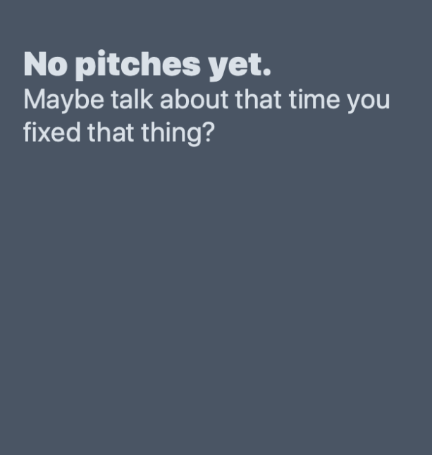
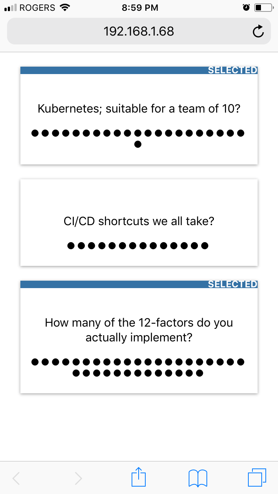
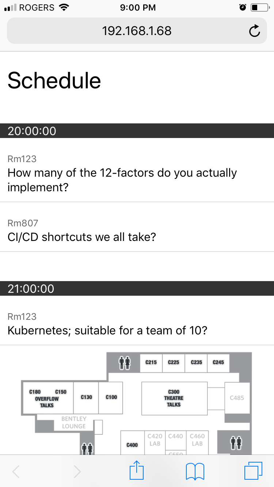

# unconf
A simple application that let's you run an unconference voting scheme without
a wall of stickies and sharpies... as much fun as that is and as much as I love
it.

Once installed, you can read the [manual for operation here](MANUAL.md).

## Setup
### Requirements
You will need Python 3.6 and Elm 0.19.0 to run this project.

`make local` should configure your Python virtual environment in `venv` and
install the required packages, as well as download the Elm packages required.

**NB. A local SQLLite database will be created for local dev.**

Once started you will want to  initialize flags and configure a superuser for
Django administration:
```
> source venv/bin/activate
> cd server
> python manage.py loaddata
> python manage.py createsuperuser
```

`make run` should take care of starting a local dev server on port 8080.

### The Client
`make client` will compile the elm source and move the result into the
appropriate static asset folder for the server. You'll likely end up doing this
often during development.

If you're running a Node environment, you can run `npm run elm-make` instead.

## Production
unconf is currently configured to run on Heroku (if there's interest, I'll
throw a Docker build in as well). It can be deployed as is to a heroku git
endpoint, though you will have to run the `python manage.py` commands
`migrate`, `loaddata`, and `createsuperuser` to get the DB configured.

**If you modify the client code, be sure to also run a `make client` to ensure
that the modified client is compiled before you commit and push to heroku.**

During our run with a ~400 attendee count, autoscaling nodes were able to
handle the traffic at a peak of 3 x1 dynos, (though obviously warming up the dynos
will help). You can probably get away with the free tier version of Heroku's
offereing for similar or smaller events.

**NB. Also consider spinning up a second free-tier version of the application
and substitution the main app's DB string in, to use for administrative purposes
like entering the pitches. This will save you any lag in input flow in the event
that your attendees flood the main web nodes.**


### Environment Variables
#### SECRET_KEY
Django does some pretty nice security things for you out of the box, but you
really ought to set this to help it do that. A long random string will do.

#### DEBUG
Please set to `False` in production.

#### HOSTNAME
Django only allows a select list of hostnames. Set this to lock it down to
exactly your app's name, or to `0.0.0.0` to allow any hostnames.

#### DATABASE_URL
This should be set automatically by Heroku when Postgres is added. Leave it
empty for local dev to get Djano to use a local SQLite3.

#### COLLAPSE_SEPARATOR
If you don't fancy the `-` string that appears between two pitches when they
are collapsed together, you may set this envvar to a string of your choice.

I leave newline escaping as an exercise for the reader.

## About the Security Model
unconf is designed to replace sticky notes and dots with a sharpie marker. As
such the application is not especially security conscious, and rather errs on
the side of intuitive and easy to use for the audience.

Given the nature of developers, it might be helpful to remove the temptation of
attendees to prove how clever they in their ability to "beat" the app by simply
explaining to all attendees exactly how to "cheat" and vote multiple times:
_Clear your cookies_. Now that no one has anything to prove by "hacking" the
app, you should be free to continue your event in peace.


## Screenshots

### Pitches
As pitches are made, an organizer inputs the pitch into the administrative
portal. As they are saved the client polls for new pitches and they begin to
appear on the screen.



___

### Voting
As an attendee votes, their selections are marked by their yellow voting dot and
a yellow bar on the top of the pitch. Tapping on a pitch will unvote the topic.



As other members vote, the relative popularity of pitches becomes apparent as
indicated by blue dots across the pitch card.

___

### Schedule View
Once all the voting is done, the administrator generates a schedule
(algorithmically sorted to alot large rooms to popular talks) and switches a
flag in the admin portal to schedule view.

The lineup is displayed, along with a venue map.


